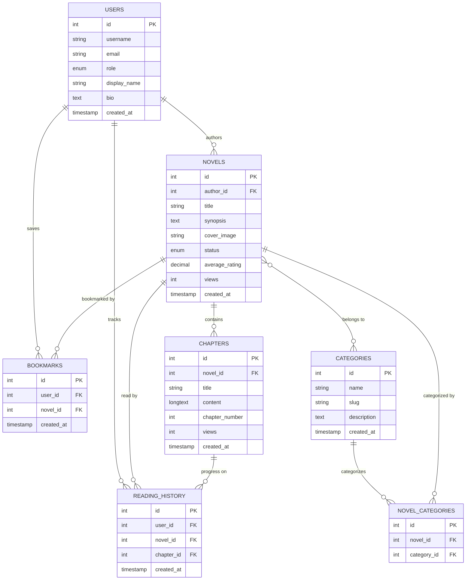

# 📚 Narria - Novel Reading Platform


> **Narria** adalah platform baca novel online berbasis CodeIgniter 4 yang memungkinkan pembaca menjelajahi berbagai novel, dan penulis (role Author) dapat mengunggah karya mereka sendiri.

<div align="center">

[](https://php.net/)
[](https://codeigniter.com/)
[](https://mysql.com/)
[](LICENSE)
[](https://github.com/naaufal/narria/stargazers)

[Report Bug](https://github.com/naaufal/narria/issues) • [Request Feature](https://github.com/naaufal/narria/issues)

</div>

---

## 🌟 Features

### 👥 **Multi-Role System**
- **👤 Reader**: Browse, read, and bookmark novels
- **✍️ Author**: Create and manage your own novels  
- **🛡️ Admin**: Full platform management and moderation

### 📖 **Core Functionality**
- 🔐 **Secure Authentication**: User registration and login system
- 📚 **Novel Library**: Beautiful gallery of available novels
- 📖 **Chapter Reading**: Clean reading experience with progress tracking
- 🔍 **Smart Search**: Search and filter by title, author, or category
- 🏷️ **Categorization**: Organize novels by genres and tags
- 📊 **Reading History**: Track your reading progress automatically
- 🔖 **Bookmarks**: Save your favorite novels for later
- ⭐ **Rating System**: Rate and review novels
- 👤 **User Profiles**: Customizable profiles for readers and authors

### 🎨 **Modern Interface**
- 📱 **Responsive Design**: Works perfectly on all devices
- 🎨 **Clean UI**: Bootstrap 4 + Tailwind CSS styling
- 📈 **Admin Dashboard**: Comprehensive management panel using Stisla template
- 🌙 **Dark Mode Ready**: Eye-friendly reading experience

---

## 🏗️ Database Architecture



---

## 🛠️ Tech Stack

### **Backend**
- **Framework**: CodeIgniter 4 (MVC Pattern)
- **Language**: PHP 8.1+
- **Database**: MySQL/MariaDB
- **Authentication**: CodeIgniter 4 Shield/Session-based Auth

### **Frontend**
- **CSS Framework**: Bootstrap 4
- **Utility Framework**: Tailwind CSS
- **Admin Template**: Stisla Admin Template
- **Icons**: Font Awesome
- **JavaScript**: Vanilla JS + jQuery

### **Development Tools**
- **Dependency Manager**: Composer
- **Version Control**: Git
- **Database Migration**: CodeIgniter Migration System

---

## ⚙️ System Requirements

Make sure your system meets the following requirements:

### **Server Requirements**
- **PHP**: 8.1 or higher
- **MySQL**: 5.7+ or MariaDB 10.3+
- **Web Server**: Apache/Nginx

### **Required PHP Extensions**
- `intl` - Internationalization support
- `mbstring` - Multibyte string handling
- `json` - JSON support (enabled by default)
- `mysqlnd` - MySQL Native Driver
- `libcurl` - For HTTP/CURLRequest (if needed)

### **Development Tools**
- **Composer** - PHP dependency manager
- **Git** - Version control system

---

## 🚀 Installation Guide

### **1. Clone Repository**
```bash
git clone https://github.com/naaufal/narria.git
cd narria
```

### **2. Install Dependencies**
```bash
composer install
```

### **3. Environment Configuration**
```bash
# Copy environment file
cp env .env

# Edit configuration
nano .env
```

**Important configurations in `.env`:**
```env
# Application
app.baseURL = 'http://localhost:8080/'

# Database
database.default.hostname = localhost
database.default.database = narria_db
database.default.username = your_username
database.default.password = your_password
database.default.DBDriver = MySQLi
```

### **4. Database Setup**
```bash
# Run migrations
php spark migrate

# Run seeders (optional)
php spark db:seed DatabaseSeeder
```

### **5. Start Development Server**
```bash
# Using CodeIgniter built-in server
php spark serve --host=localhost --port=8080

# Or using specific host/port
php spark serve --host=0.0.0.0 --port=3000
```

### **6. Access Application**
Open your browser and visit: **http://localhost:8080**

---

## 🎯 Development Notes

### **MVC Architecture**
This project follows CodeIgniter 4's MVC (Model-View-Controller) pattern:

- **Models** (`app/Models/`): Handle database operations and business logic
- **Views** (`app/Views/`): Handle UI presentation and templates  
- **Controllers** (`app/Controllers/`): Handle user requests and coordinate between models and views

### **Key Directories**
```
narria/
├── app/
│   ├── Controllers/     # Request handling logic
│   ├── Models/          # Database models
│   ├── Views/           # HTML templates
│   ├── Config/          # Application configuration
│   └── Database/        # Migrations and seeders
├── public/              # Web accessible files
├── writable/            # Cache, logs, session data
└── vendor/              # Composer dependencies
```

### **Development Workflow**
1. **Database changes**: Create migrations in `app/Database/Migrations/`
2. **New features**: Follow Controller → Model → View pattern
3. **Styling**: Edit CSS/JS files in `public/assets/`
4. **Testing**: Use built-in PHP server with `php spark serve`

---

## 📖 Usage Guide

### **For Readers**
1. **Register** as a new user or **Login** to existing account
2. **Browse** the novel library on the homepage
3. **Search** for specific novels using the search bar
4. **Filter** novels by categories or authors
5. **Click** on a novel to view details and start reading
6. **Track** your reading progress automatically
7. **Bookmark** your favorite novels

### **For Authors**
1. **Register** with author role or request role upgrade
2. **Access** author dashboard from your profile
3. **Create** new novels with cover images and descriptions
4. **Add** chapters to your novels
5. **Manage** your published content
6. **View** statistics and reader engagement

### **For Administrators**
1. **Login** with admin credentials
2. **Manage** users, novels, and categories
3. **Monitor** platform activity and statistics
4. **Moderate** content and user reports
5. **Configure** system settings

---

## 🤝 Contributing

We welcome contributions from the community! Here's how you can help:

### **How to Contribute**
1. **Fork** the repository
2. **Create** a new feature branch
   ```bash
   git checkout -b feature/amazing-feature
   ```
3. **Make** your changes and commit
   ```bash
   git commit -m "Add: Amazing new feature"
   ```
4. **Push** to your branch
   ```bash
   git push origin feature/amazing-feature
   ```
5. **Open** a Pull Request

### **Contribution Guidelines**
- Follow PSR-12 coding standards for PHP
- Follow CodeIgniter 4 best practices and conventions
- Write meaningful commit messages
- Update documentation when needed
- Test with `php spark serve` before submitting
- Respect the existing MVC structure

### **Types of Contributions**
- 🐛 Bug fixes
- ✨ New features
- 📝 Documentation improvements
- 🎨 UI/UX enhancements
- 🔧 Performance optimizations
- 🌐 Translations

---

## 📝 API Documentation

### **Available Endpoints**

| Method | Endpoint | Description | Auth Required |
|--------|----------|-------------|---------------|
| `GET` | `/api/novels` | Get all novels | ❌ |
| `GET` | `/api/novels/{id}` | Get novel details | ❌ |
| `GET` | `/api/novels/{id}/chapters` | Get novel chapters | ❌ |
| `POST` | `/api/novels` | Create new novel | ✅ |
| `PUT` | `/api/novels/{id}` | Update novel | ✅ |
| `DELETE` | `/api/novels/{id}` | Delete novel | ✅ |

*For complete API documentation, see [API.md](docs/API.md)*

---

## 🔒 Security

### **Security Features**
- ✅ **CSRF Protection**: Built-in CSRF token validation
- ✅ **SQL Injection Prevention**: Using prepared statements
- ✅ **XSS Protection**: Input sanitization and output escaping
- ✅ **Secure Authentication**: Hashed passwords with bcrypt
- ✅ **Session Security**: Secure session handling

### **Reporting Vulnerabilities**
If you discover a security vulnerability, please send an email to [security@narria.com](mailto:security@narria.com). Do not create public issues for security vulnerabilities.

---

## 📊 Project Status

### **Current Version**: v1.0.0
### **Development Status**: Active Development 🚧
### **Environment**: Local Development (php spark serve)

### **Roadmap**
- [ ] 🌐 Live Demo Deployment
- [ ] 📱 Mobile-Responsive Improvements
- [ ] 🌐 Multi-language Support
- [ ] 💬 Comment System for Novels
- [ ] 📧 Email Notifications
- [ ] 📈 Reading Analytics Dashboard
- [ ] 🎨 Theme Customization
- [ ] 📚 Reading Lists & Collections
- [ ] 🏆 Achievement System
- [ ] 🔌 REST API (Future consideration)

---

## 📄 License

This project is licensed under the **MIT License** - see the [LICENSE](LICENSE) file for details.

```
MIT License

Copyright (c) 2025 Naaufal

Permission is hereby granted, free of charge, to any person obtaining a copy
of this software and associated documentation files (the "Software"), to deal
in the Software without restriction, including without limitation the rights
to use, copy, modify, merge, publish, distribute, sublicense, and/or sell
copies of the Software, and to permit persons to whom the Software is
furnished to do so, subject to the following conditions:

The above copyright notice and this permission notice shall be included in all
copies or substantial portions of the Software.
```

---

## 👨‍💻 Author & Maintainer

<div align="center">

**[Naaufal](https://github.com/naaufal)**

[](https://github.com/naaufal)
[](mailto:naaufal.dev@gmail.com)

*Developed with ❤️ by [naaufal](https://github.com/naaufal)*

</div>

---

## ⭐ Support

If you found this project helpful, please consider:

- ⭐ **Starring** this repository
- 🐛 **Reporting** bugs and issues
- 💡 **Suggesting** new features
- 🤝 **Contributing** to the codebase
- 📢 **Sharing** with others

---

## 📞 Support & Contact

- **Issues**: [GitHub Issues](https://github.com/naaufal/narria/issues)
- **Discussions**: [GitHub Discussions](https://github.com/naaufal/narria/discussions)
- **Email**: [naaufal.dev@gmail.com](mailto:naaufal.dev@gmail.com)

---

<div align="center">

**⭐ Don't forget to star this repo if it helped you! ⭐**

</div>
